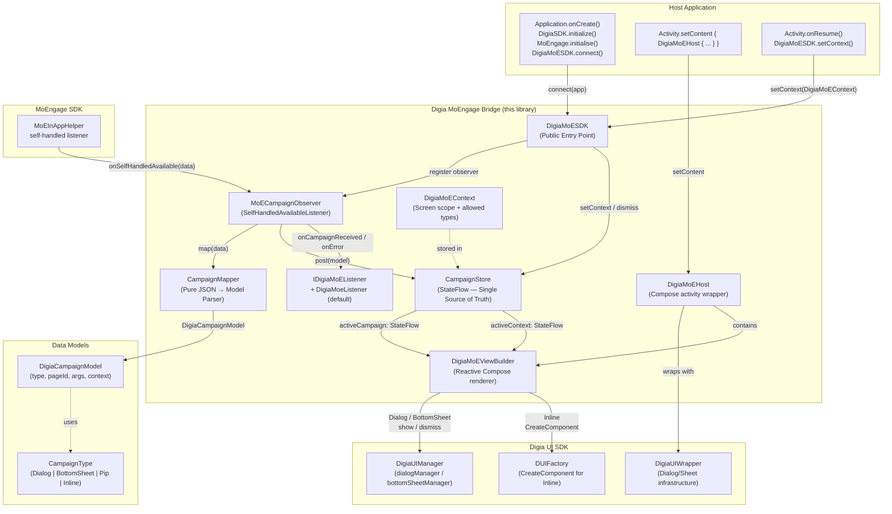
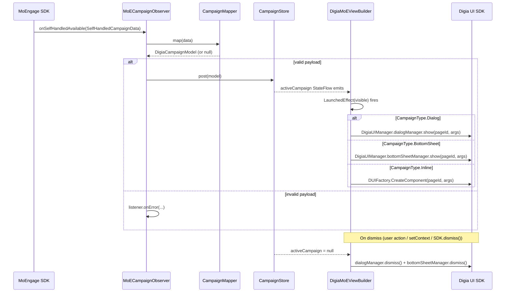
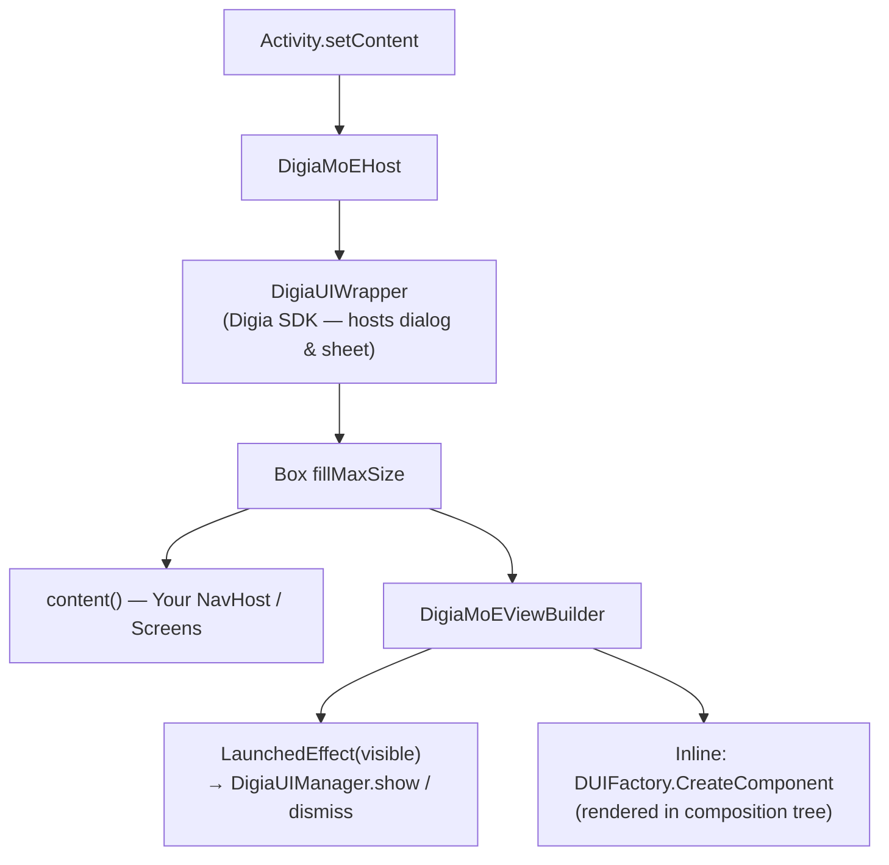
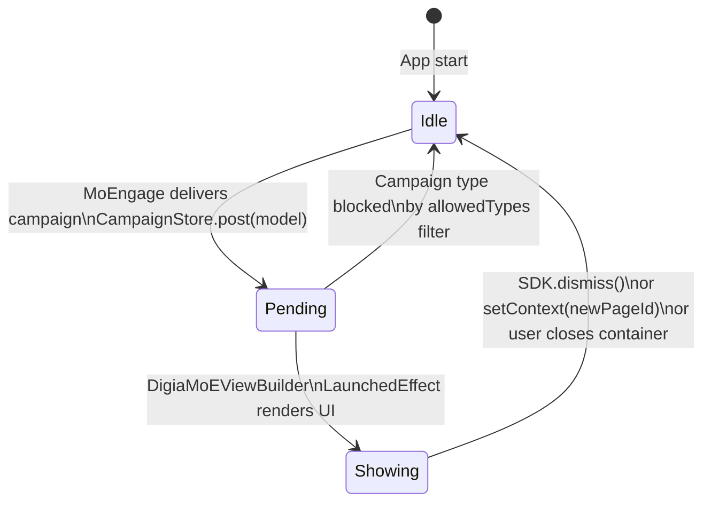
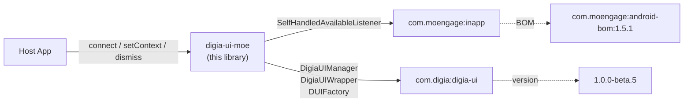

# Digia MoEngage Bridge — Architecture

This document describes the architecture of the **Digia MoEngage Bridge** — an Android library that connects [MoEngage](https://www.moengage.com/) self-handled in-app campaigns to the [Digia UI SDK](https://digia.tech/) for server-driven, reactive UI rendering.

---

## Overview

The bridge acts as a thin reactive glue layer between two external SDKs:

| External SDK | Role |
|---|---|
| **MoEngage SDK** | Delivers self-handled in-app campaign payloads at runtime |
| **Digia UI SDK** | Server-driven Compose UI engine that renders pages by ID |

The library receives a campaign from MoEngage, parses its JSON payload, stores it in a reactive `StateFlow`, and lets a Compose host component render the correct Digia page inside the appropriate container (Dialog, BottomSheet, PIP overlay, or Inline).

---

## High-Level Architecture Diagram



---

## Component Breakdown

### Public API

| Class / Object | Package | Responsibility |
|---|---|---|
| `DigiaMoESDK` | `com.digia.digia_moengage` | Single public entry-point. Exposes `connect()`, `setContext()`, and `dismiss()`. |
| `DigiaMoEContext` | `com.digia.digia_moengage.compose` | Scoping value set per-screen. Holds `currentPageId` and `allowedTypes`. |
| `IDigiaMoEListener` | `com.digia.digia_moengage.contract` | Optional host callback interface: `onCampaignReceived`, `onError`. |

### Compose UI Layer

| Composable | Responsibility |
|---|---|
| `DigiaMoEHost` | Activity-level wrapper. Embeds `DigiaUIWrapper` (Digia SDK dialog/sheet host) and `DigiaMoEViewBuilder` as one-time setup. |
| `DigiaMoEViewBuilder` | Collects `CampaignStore` state. Runs a single `LaunchedEffect(visible)` that calls `DigiaUIManager` show/dismiss for Dialog and BottomSheet, or renders `DUIFactory.CreateComponent` for Inline campaigns. |

### Internal Layer

| Class / Object | Responsibility |
|---|---|
| `MoECampaignObserver` | Implements `SelfHandledAvailableListener`. Receives raw `SelfHandledCampaignData` from MoEngage and routes it through `CampaignMapper` → `CampaignStore`. |
| `CampaignMapper` | Pure, side-effect-free parser. Converts a MoEngage JSON payload string into a typed `DigiaCampaignModel`. Returns `null` for invalid payloads. |
| `CampaignStore` | Internal `object` holding two `MutableStateFlow`s: `activeCampaign` and `activeContext`. Auto-dismisses the active campaign when the page ID changes. |
| `DigiaMoeListener` | Default `IDigiaMoEListener` implementation. Logs errors; all UI is driven by the store. |

### Data Models

| Class | Fields | Notes |
|---|---|---|
| `DigiaCampaignModel` | `type`, `pageId`, `args`, `context`, `settings` | Domain model, immutable data class |
| `CampaignType` | `Dialog`, `BottomSheet`, `Pip`, `Inline` | Sealed class, parsed from the `"type"` field in the campaign JSON |

---

## Data Flow



---

## Campaign JSON Payload Contract

MoEngage self-handled campaigns must carry a JSON body in the payload field:

```json
{
  "type":    "dialog | bottomsheet | overlayvideo | inline",
  "id":      "<digia-page-id>",
  "args":    { "param1": "value1" },
  "context": { "screen": "home" }
}
```

| Field | Required | Description |
|---|---|---|
| `type` | Yes | Determines the Compose container. Maps to `CampaignType`. |
| `id` | Yes | Digia page ID to render. |
| `args` | No | Key-value arguments forwarded to the Digia page. |
| `context` | No | Metadata such as screen name or user segment. |

---

## Compose Tree (Runtime)



---

## State Machine: CampaignStore



---

## Module Dependencies



---

## Host Integration Checklist

```
Application.onCreate()
  ├── 1. DigiaSDK.initialize(DigiaUIOptions(context, accessKey))   // async
  ├── 2. MoEngage.initialiseDefaultInstance(...)                   // sync
  └── 3. DigiaMoESDK.connect(app = application)                   // register observer

Activity.setContent {
  └── 4. DigiaMoEHost {
            YourNavHost()                                          // wrap entire nav graph
         }
}

Activity / NavDestination.onResume()
  └── 5. DigiaMoESDK.setContext(
              DigiaMoEContext(
                  currentPageId = "screen_id",
                  allowedTypes  = CampaignType.all()              // restrict per screen if needed
              )
         )
```

---

## Package Structure

```
com.digia.digia_moengage
├── DigiaMoESDK.kt              # Public entry-point singleton
├── MoECampaignObserver.kt      # MoEngage listener (internal)
├── CampaignMapper.kt           # JSON → Model parser (internal)
├── compose/
│   ├── DigiaMoEHost.kt         # Activity-level Compose wrapper
│   ├── DigiaMoEViewBuilder.kt  # Reactive campaign renderer
│   └── DigiaMoEContext.kt      # Screen scoping data class
├── contract/
│   ├── IDigiaMoEListener.kt    # Public host callback interface
│   └── DigiaMoeListener.kt     # Default no-op implementation (internal)
├── internal/
│   └── CampaignStore.kt        # StateFlow store (internal)
└── model/
    ├── DigiaCampaignModel.kt   # Domain model
    └── CampaignType.kt         # Sealed class for campaign types
```
